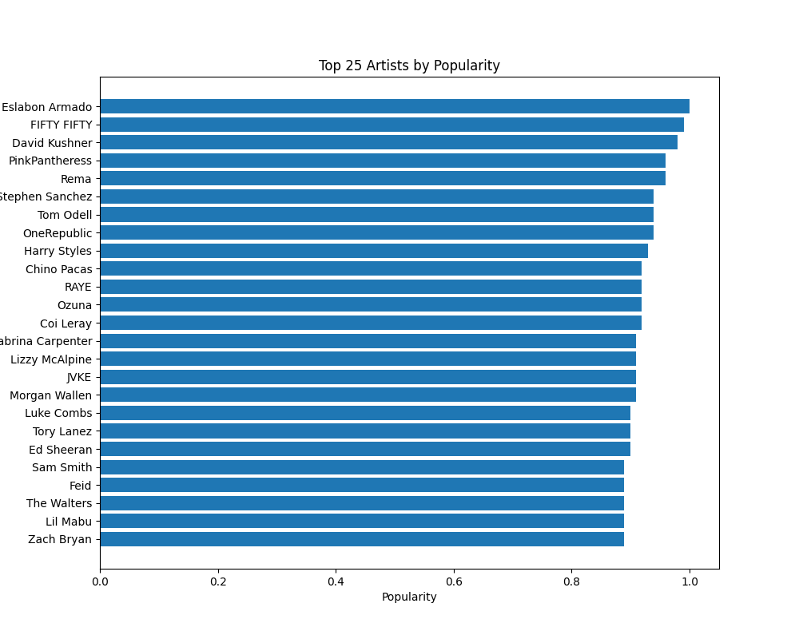
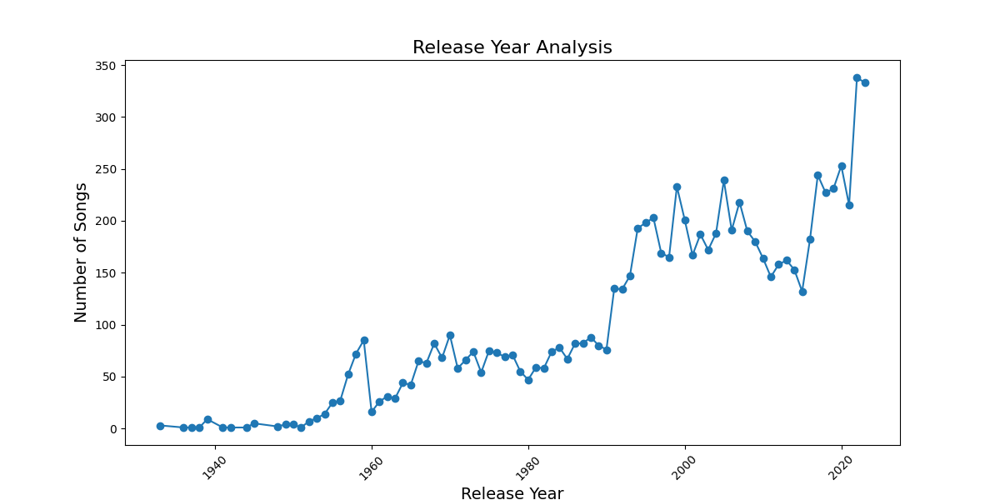

# Spotify Recommender Project
---
By William Lopez, E-mail: williamlopez9449@gmail.com
## Table of Contents
---
1. [Data Collection](https://github.com/WillLopez6/spotify_recommender/blob/main/code/Data_Collection.ipynb)
2. [Data Cleaning](https://github.com/WillLopez6/spotify_recommender/blob/main/code/Data_Cleaning.ipynb)
3. [Exploratory Data Analysis](https://github.com/WillLopez6/spotify_recommender/blob/main/code/EDA_Notebook.ipynb)
4. [Modeling](https://github.com/WillLopez6/spotify_recommender/blob/main/code/Modeling_Recommender.ipynb)
5. [Streamlit Spotify App](https://drive.google.com/drive/folders/1L-QhSbuvlB0AAAa56lZYakKxheycvi2m?usp=sharing)
## Problem Statement
---
Recently, Spotify has decided to try and improve the recommendation system used by their current app by implementing something that is more content-based. As a data scientist I was hired to create a recommender that recommends songs based on Artist and Song Title, additionally I am to include a similar time frame for the release year of the song. Spotify requested that I focus on song features like Danceability, Instrumentalness, Popularity of the song, etc. The goal is to improve the listener experience to make the application more appealing than other competitors like Apple Music and TIDAL by creating a model that analyzes the characteristics of the tracks and creates more niche recommendations that enhance the user experience.

## Repository Overview
---
This repository consists of the following:

The directory <code>../code</code> contains 4 notebooks that compose the project:

- 1. In <b> Data_Collection.ipynb</b>, I collected data from the Spotify API using the  spotipy library along with my authentication tokens from the [Spotify Dev](https://developer.spotify.com/) website.
- 2. In <b> Data_Cleaning.ipynb </b>I looked at the data, checked for any missing values, duplicates, and created a clean data csv found in the <code>../data</code>.
- 3. In <b>EDA_Notebook.ipynb</b> I examined the features of the data like genre, popularity, etc. I also created visuals that assist the data analysis done in that notebook.
- 4. In <b>Modeling_Recommender.ipynb</b> I modeled a recommender model using cosine_similarity and also provided a conclusion and recommendations to the model.
- 5. Lastly, there is an accompanying Streamlit app with a pickle file that can be found [here.](https://drive.google.com/drive/folders/1L-QhSbuvlB0AAAa56lZYakKxheycvi2m?usp=sharing)

        
## Software/Library Requirements
---
1. Pandas
2. Numpy
3. Matplotlib
4. Seaborn
5. Time
6. os
7. urllib.request
8. wordcloud
9. PIL
10. Scikit-learn
11. Regular Expression(re)
12. Pickle
13. spotipy
14. spotipy.oauth2
## Dataset and Approach
---
As a Spotify user I have noticed that often times, when looking for new music within a genre or by the same artist Spotify will recommend something that is completely out of my taste or time period. Oftentimes Spotify will mix what I consider 'the great artists' with 'not so great artists'. The goal of the project was to create a recommender that would recommend music based on a similar time-frame or similar artist using features like instrumentalness, popularity, energy, danceability, and even the release year.

In this project I collected data using the Spotify API from different time periods to try and create a recommender model that would recommend songs with a high similarity to song and artist. In order to collect the data we used playlist links to create a more diverse dataset rather than using my own song library. When collecting the data I was not concerned about any null values or duplicates since that can be dealt with during the data cleaning steps. Additionally, the Spotify API allows for very detailed track data like the title, artist, album, and other numeric features like danceability, energy, release year and date.
## Data Dictionary
---
| Documentation | Description |
| -------------- | -------------- |
| Track | Title of the Song |
| Artist | Name of Artist plus features if any. |
| Genre | A list of genres the song is associated with. |
| Album Title | Album Title |
| Album Type | Defines whether a single or full album. |
| Release Date | Includes month, day, and year if available. |
| Release Year | Release year only. |
| Thumbnail | Link to the album cover(thumbnail size). |
| Track ID | Unique identifier for the song |
| Acousticness | 0(lowest) - 1(highest) measure of acoustic sound in song. |
| Instrumentalness | 0(lowest) - 1(highest) measure of whether or not the song contains any vocals. |
| Speechiness | 0(lowest) - 1(highest) Detects the amount of vocals in the song. Anything over 0.66 describes the tracks that are probably composed of words only. |
| Daceability | 0(lowest) - 1(highest) describes how suitable the song is for dancing based on a combination of tempo, rhythm stability, beat strength, and oberall regularity. |
| Energy | 0(lowest) - 1(highest) measures the intensity and acitivity of the song. |
| Popularity | 0(lowest) - 100(highest) measures the popularity of the album. |
- [Here](https://developer.spotify.com/documentation/web-api/reference/get-several-audio-features) You can find additional information on the features as well as other features that can be extracted from the API.

## Data Collection and EDA
---
To collect out data I used the Spotify API. In order to get the API to work you need to have a Spotify account, otherwise you need to sign up in order to have access to the application developer dashboard. In the dashboard you need to create and application which will allow you to obtain your <code>client_id</code> and your <code>client_secret</code> which are used to authenticate your connection to the API. The API will provide you with an authentication code that lasts 3600 seconds, or in other words, 60 minutes. My approach to gather data was using the Spotipy library and the <code>from spotipy.oauth2 import SpotifyClientCredentials</code> which creates the authentication codes for you automatically, it just needs to be included in your code when requesting the data. I used playlist url links which allowed me to extract all the songs per playlist, [here](https://drive.google.com/drive/folders/1L-QhSbuvlB0AAAa56lZYakKxheycvi2m?usp=sharing) I have provided a link to the .txt file for the playlists used.

Below we can see the Top 25 Most Popular Artists

During the EDA I looked at several features. I looked at the top 15 songs by popularity, the bottom 15 songs by popularity. I also looked at the 25 most repeated artists and the 25 least repeated artist in the dataset.  Additionally we looked at the Top 25 artists by popularity and also looked at the 25 least popular artists. Something I want to point out is that artists with the lowest popularity had a popularity of zero, this means that there is nothing to show in the horizontal bar chart that was used. The older listed songs comes from the January 1st, 1933 and the most recent comes from June 2nd, 2023 which was days before I finalized my data collection process. 

Below we can see the distribution of music released throughout the years and how it changed as the years have gone by.

## Modeling
--- 
## Streamlit App
---
Here is the [link](https://drive.google.com/drive/folders/1L-QhSbuvlB0AAAa56lZYakKxheycvi2m?usp=sharing) to the streamlit application code along with the pickle file that was used.

If there are any issues please feel free to reach out to me via email provided above.
## Conclusions / Recommendations
