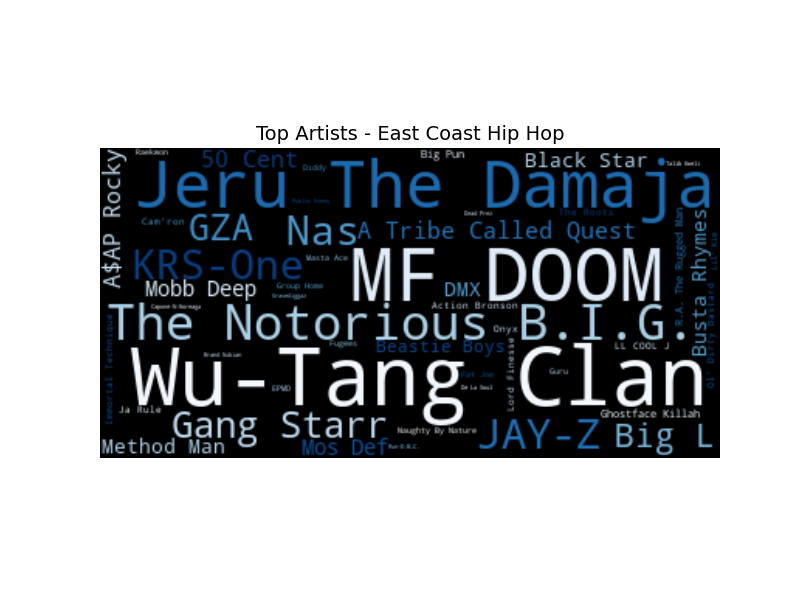
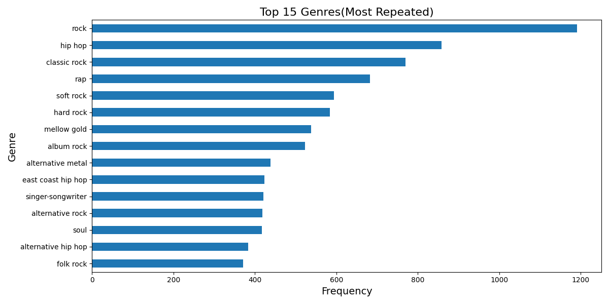

# Spotify Recommender Project
---
By William Lopez, E-mail: williamlopez9449@gmail.com

## Table of Contents
---
This repository contains the following notebooks:
1. [Data Collection](https://github.com/WillLopez6/spotify_recommender/blob/main/code/Data_Collection.ipynb)
2. [Data Cleaning](https://github.com/WillLopez6/spotify_recommender/blob/main/code/Data_Cleaning.ipynb)
3. [Exploratory Data Analysis](https://github.com/WillLopez6/spotify_recommender/blob/main/code/EDA_Notebook.ipynb)
4. [Modeling](https://github.com/WillLopez6/spotify_recommender/blob/main/code/Modeling_Recommender.ipynb)
5. [Streamlit Spotify App](https://drive.google.com/drive/folders/1L-QhSbuvlB0AAAa56lZYakKxheycvi2m?usp=sharing) (External Link)
## Problem Statement
---
Recently, Spotify has decided to try and improve the recommendation system used by their current app by implementing something that is more content-based. As a data scientist I was hired to create a recommender that recommends songs based on Artist and Song Title, additionally I am to include a similar time frame for the release year of the song. Spotify requested that I focus on song features like Danceability, Instrumentalness, Popularity of the song, etc. The goal is to improve the listener experience to make the application more appealing than other competitors like Apple Music and TIDAL by creating a model that analyzes the characteristics of the tracks and creates more niche recommendations that enhance the user experience.

## Repository Overview
---
This repository consists of the following:

The directory <code>../code</code> contains 4 notebooks that compose the project:

- 1. In <b> Data_Collection.ipynb</b>, I collected data from the Spotify API using the  spotipy library along with my authentication tokens from the [Spotify Dev](https://developer.spotify.com/) website.
- 2. In <b> Data_Cleaning.ipynb </b>I looked at the data, checked for any missing values, duplicates, and created a clean data csv found in the <code>../data</code>.
- 3. In <b>EDA_Notebook.ipynb</b> I examined the features of the data like genre, popularity, etc. I also created visuals that assist the data analysis done in that notebook.
- 4. In <b>Modeling_Recommender.ipynb</b> I modeled a recommender model using cosine_similarity and also provided a conclusion and recommendations to the model.
- 5. Lastly, there is an accompanying Streamlit app with a pickle file that can be found [here.](https://drive.google.com/drive/folders/1L-QhSbuvlB0AAAa56lZYakKxheycvi2m?usp=sharing)

        
## Software/Library Requirements
---
Below are the libraries that were used for this project:
1. Pandas
2. Numpy
3. Matplotlib
4. Seaborn
5. Time
6. os
7. urllib.request
8. wordcloud
9. PIL
10. Scikit-learn
11. Regular Expression(re)
12. Pickle
13. spotipy
14. spotipy.oauth2
## Dataset and Approach
---
As a Spotify user I have noticed that often times, when looking for new music within a genre or by the same artist Spotify will recommend something that is completely out of my taste or time period. Oftentimes Spotify will mix what I consider 'the great artists' with 'not so great artists'. The goal of the project was to create a recommender that would recommend music based on a similar time-frame or similar artist using features like instrumentalness, popularity, energy, danceability, and even the release year.

In this project I collected data using the Spotify API from different time periods to try and create a recommender model that would recommend songs with a high similarity to song and artist. In order to collect the data we used playlist links to create a more diverse dataset rather than using my own song library. When collecting the data I was not concerned about any null values or duplicates since that can be dealt with during the data cleaning steps. Additionally, the Spotify API allows for very detailed track data like the title, artist, album, and other numeric features like danceability, energy, release year and date.
## Data Dictionary
---
| Documentation | Description |
| -------------- | -------------- |
| Track | Title of the Song |
| Artist | Name of Artist plus features if any. |
| Genre | A list of genres the song is associated with. |
| Album Title | Album Title |
| Album Type | Defines whether a single or full album. |
| Release Date | Includes month, day, and year if available. |
| Release Year | Release year only. |
| Thumbnail | Link to the album cover(thumbnail size). |
| Track ID | Unique identifier for the song |
| Acousticness | 0(lowest) - 1(highest) measure of acoustic sound in song. |
| Instrumentalness | 0(lowest) - 1(highest) measure of whether or not the song contains any vocals. |
| Speechiness | 0(lowest) - 1(highest) Detects the amount of vocals in the song. Anything over 0.66 describes the tracks that are probably composed of words only. |
| Daceability | 0(lowest) - 1(highest) describes how suitable the song is for dancing based on a combination of tempo, rhythm stability, beat strength, and oberall regularity. |
| Energy | 0(lowest) - 1(highest) measures the intensity and acitivity of the song. |
| Popularity | 0(lowest) - 100(highest) measures the popularity of the album. |
- [Here](https://developer.spotify.com/documentation/web-api/reference/get-several-audio-features) You can find additional information on the features as well as other features that can be extracted from the API.

## Data Collection and EDA
---
To collect out data I used the Spotify API. In order to get the API to work you need to have a Spotify account, otherwise you need to sign up in order to have access to the application developer dashboard. In the dashboard you need to create and application which will allow you to obtain your <code>client_id</code> and your <code>client_secret</code> which are used to authenticate your connection to the API. The API will provide you with an authentication code that lasts 3600 seconds, or in other words, 60 minutes. My approach to gather data was using the Spotipy library and the <code>from spotipy.oauth2 import SpotifyClientCredentials</code> which creates the authentication codes for you automatically, it just needs to be included in your code when requesting the data. I used playlist url links which allowed me to extract all the songs per playlist, [here](https://drive.google.com/drive/folders/1L-QhSbuvlB0AAAa56lZYakKxheycvi2m?usp=sharing) I have provided a link to the .txt file for the playlists used.

Below we can see the Top 25 Most Popular Artists

During the EDA I looked at several features. I looked at the top 15 songs by popularity, the bottom 15 songs by popularity. I also looked at the 25 most repeated artists and the 25 least repeated artist in the dataset.  Additionally we looked at the Top 25 artists by popularity and also looked at the 25 least popular artists. Something I want to point out is that artists with the lowest popularity had a popularity of zero, this means that there is nothing to show in the horizontal bar chart that was used. The older listed songs comes from the January 1st, 1933 and the most recent comes from June 2nd, 2023 which was days before I finalized my data collection process. 

Below we can see the distribution of music released throughout the years and how it changed as the years have gone by.

Lastly, we looked at some genre analysis. Spotify provides a list of different genres/subgenres for each song so something that I noticed is that oftentimes songs in the same genre like rock will have other genres attached to it like 'metal', 'hard-rock', etc. What I did in this step was split the string and look at the repetition of values for the genres to see which were the most popular. I would like to point out that I manually inspected some of the data and there are indie bands that are also considered pop which I feel might be an issues, especially when trying to analyze the genres.

## Modeling
--- 
The objective of this recommender model is to recommend similar songs based on a variaety of features such as popularity, energy, daceability, instrumentalness, speechiness, etc. What we are trying to achieve is to retrieve songs by the same artist, album, or from artists within the same genre and release year. The data used has been label 'songs' and it comes from the <code>../data/clean_data.csv</code> file. The data is preprocessed using RegEx and the TFIDF Vectorizer to remove any special characters. The recommendation function of the model provides us with the Track, Artist, Album Title, Release Year and the Thumbnail. In the code notebook the thumbnail does not serve a purpose, this is directed towards the Streamlit app we created which shows us the thumbnail of the album along with the other give information. Additionally the code can be extended to include additional features when making recommendations for example we can include the popularity of the song or the energy if we want to see the tempo for the song. Ideally I would have liked to incorporate the genre but since Spotify provides a compilation of genres per song the output was rather messy and hard to understand, not only that but it also caused the output in the Streamlit app to look cluttered and unorganized.

## Streamlit App
---
In the Streamlit App we use the recommender model to print out the 10 most similar songs. From the modeling code we can use special characters or ignore them if we'd like. Additionally there is an added feature that allows the user to print out 5 random songs from the dataset in case they want to discover something new or if the user is unsure on what they want to listen to that is a good way to possibly discover something new or maybe even a forgotten gem.

Here is the [link](https://drive.google.com/drive/folders/1L-QhSbuvlB0AAAa56lZYakKxheycvi2m?usp=sharing) to the streamlit application code along with the pickle file that was used for it.

If there are any issues please feel free to reach out to me via email provided at the beginning of the readme.
## Conclusions / Recommendations
---
Based on the two predictions above we received failry similar music recommendations. We can see that searching for an Artist will return anything related to that artist, or something similar. Additionally, we are able to search for a song and an artist and the recommender will return artists within the same genre and similar release years. We know that Spotify does well with their suggestion systems and it is a good way to find a variety of music from different time eras as well as sub-genres and artists. Something that could help improve the Spotify system would be having a main genre and a separate sub-genre section that way it is easier to classify songs using a main genre and then looking at sub-genres to get even more accurate recommendations.